# はじめに
playgroundのURL: https://pl-workshop.github.io/pl-workshop/

## プログラミング言語処理系の仕組み
私達がこれから作る言語処理系は、与えられたプログラム(=文字列)を、構文解析して抽象構文木へと変換し、その抽象構文木を再帰的に評価します。(この方式を**tree-walking型インタプリタ**と言います。非常にシンプルな方式でありながら、Rubyのバージョン1.8以下で採用されていた等実績ある方式です。)

今の説明を図にすると、以下の通りになります。

## 構文解析
**構文解析**(Parsing)とは、文字列として与えられたプログラムを、コンピュータにとって取り扱いやすい木構造へと変換することです。

具体例として、1+2を構文解析してみましょう。すると、以下のような木構造となります。

1+2+3ならどうなるでしょう。左から順に計算するとすると...？

このように、先に計算する部分ほど、木の深い場所に位置します。

こうして出来た木のことを、**抽象構文木**(AST, Abstract Syntax Tree)と言います。

## 評価
次に、構文解析して出来たASTを、評価関数で再帰的に**評価**(evaluate)します。先程の足し算の例で考えてみましょう。

足し算の評価規則は、例えば次のようなものです。
1. +演算子の左側の式を**評価**する
1. +演算子の右側の式を**評価**する
1. 1で評価された値と、2で評価された値を足す

評価規則に、**評価**という言葉が出てくることに注意してください。これは、この評価規則が再帰的であることを示しています。

(再帰について良く知っている人は、上の評価規則の**基底部**がどこにあるのか気になるかもしれません。この場合、基底部は数字自体になります。)

それでは、1+2+3を構文解析して出来た以下のASTを評価してみましょう。

まず、木の頂上に位置する+の左側の木を評価します。

この木の左側を評価すると1、右側を評価すると2になるので、この木を評価した結果は**3**(=1+2)となります。

次に、1+2+3のASTの頂上に位置する+の右側を評価すると、3になります。
最後に、左側と右側の木の評価結果を足した**6**(=3+3)が全体の評価結果となります。

評価、再帰のイメージは掴めましたでしょうか？それでは、実際に言語処理系を書いていきましょう！
